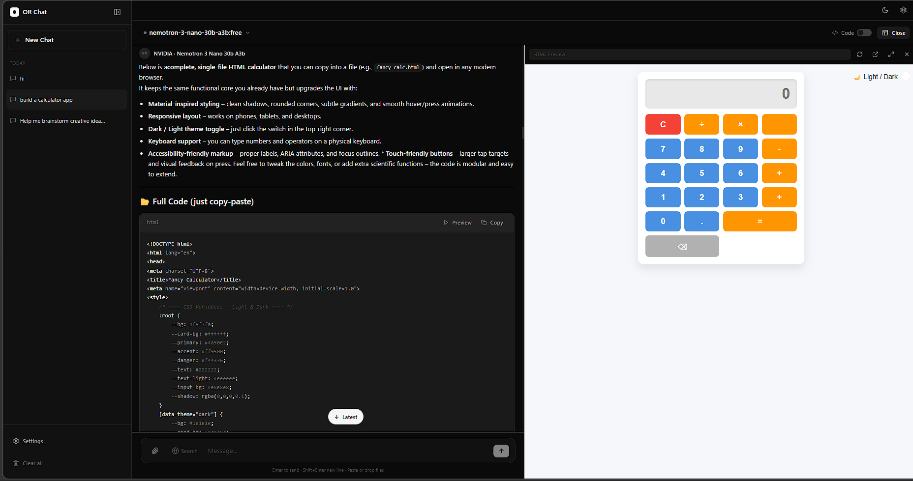
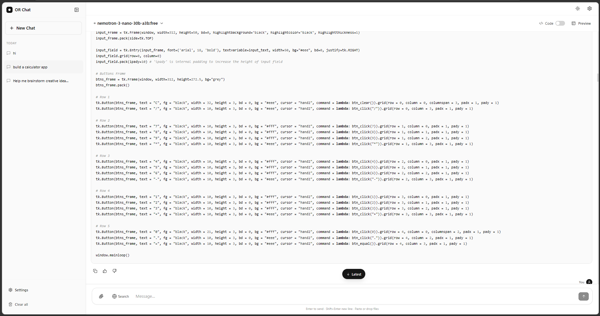
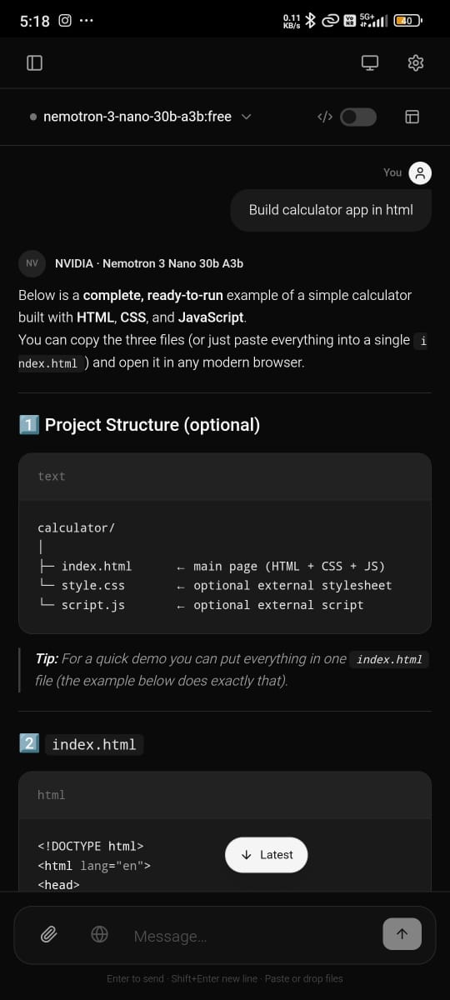
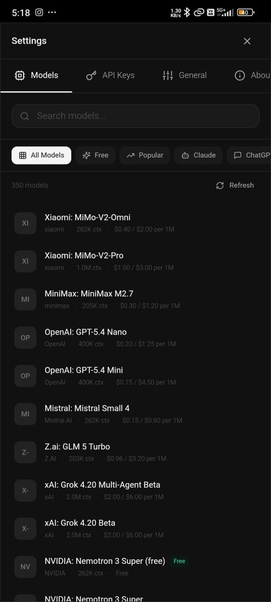
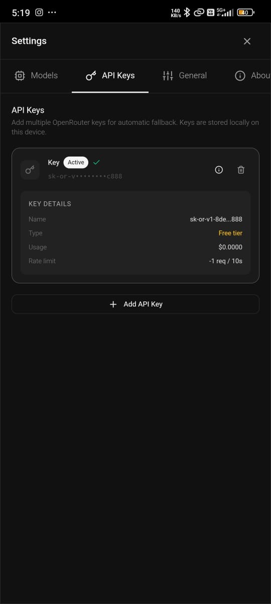

<div align="center">


# ORChat

**A minimal, modern AI chat application powered by [OpenRouter.ai](https://openrouter.ai)**

Access **200+ AI models** — Claude, GPT-4, Gemini, Llama, Mistral and more —  
all from one clean, fast interface. Available on **Web** and **Android**.

[](LICENSE)
[](https://nextjs.org)
[](https://typescriptlang.org)
[](https://tailwindcss.com)
[](https://capacitorjs.com)

[✨ Features](#features) · [🚀 Quick Start](#quick-start) · [📱 Android APK](#android-apk) · [🖼️ Screenshots](#screenshots) · [🤝 Contributing](#contributing)

---


</div>

---

## ✨ Features

| Feature | Details |
|---|---|
| 🤖 **200+ AI Models** | Claude 3.5, GPT-4o, Gemini 2.0, Llama 3, Mistral, DeepSeek & more |
| 🆓 **Free Tier** | Filter and use free models — no credit card required |
| 🔑 **Multiple API Keys** | Add multiple OpenRouter keys with automatic fallback |
| 📂 **Model Categories** | Filter by Free · Popular · Claude · ChatGPT · Gemini · Code · Image · Voice · Search |
| 💬 **Streaming Responses** | Real-time token-by-token output |
| 🌓 **Dark / Light Mode** | System preference detection + manual toggle |
| 📝 **Markdown Rendering** | Full GFM — code blocks, tables, lists, headings |
| 📋 **Copy Code** | One-click copy on every code block |
| 🖥️ **Live Preview** | Preview HTML/CSS/JS code in a split panel |
| ⌨️ **Code Mode** | Developer-focused responses with structured code output |
| 📎 **File Upload** | Attach images, text files, code — drag & drop or paste |
| 🔍 **Web Search** | Auto-switches to search-capable models (Perplexity) |
| 💾 **Chat History** | Persistent conversations stored locally |
| ✏️ **Rename & Delete** | Full conversation management |
| 📱 **Android App** | Native Android app via Capacitor |
| ⚡ **Keyboard Shortcuts** | Power-user friendly |

---

## 🖼️ Screenshots

<div align="center">

### Desktop — Dark Mode
<!-- Replace with your actual screenshot -->


### Desktop — Light Mode  


### Mobile — Android
<table>
  <tr>
    <td></td>
    <td></td>
    <td></td>
  </tr>
  <tr>
    <td align="center">Chat</td>
    <td align="center">Model Selector</td>
    <td align="center">Settings</td>
  </tr>
</table>

</div>

---

## 🚀 Quick Start

### Prerequisites

- [Node.js 18+](https://nodejs.org)
- [OpenRouter API Key](https://openrouter.ai/keys) — free to create

### 1. Clone the repository

```bash
git clone https://github.com/yourusername/orchat.git
cd orchat
2. Install dependencies
Bash

npm install
3. Run development server
Bash

npm run dev
Open http://localhost:3000 in your browser.

4. Add your API key
Click Settings (⚙️) in the top right
Go to API Keys tab
Paste your key from openrouter.ai/keys
Start chatting!
📱 Android APK
Download
👉 Download latest APK from GitHub Releases

Build from source
Bash

# 1. Install Android dependencies
npm install @capacitor/core @capacitor/cli @capacitor/android

# 2. Build the web app
npm run build

# 3. Sync to Android
npx cap sync android

# 4. Open in Android Studio
npx cap open android
# Then: Build → Generate Signed APK
⌨️ Keyboard Shortcuts
Shortcut	Action
⌘K / Ctrl+K	New chat
⌘B / Ctrl+B	Toggle sidebar
⌘, / Ctrl+,	Open settings
Esc	Close modal / Stop generation
Enter	Send message
Shift+Enter	New line
🏗️ Tech Stack
Layer	Technology
Framework	Next.js 14 (App Router, Static Export)
Language	TypeScript 5
Styling	Tailwind CSS 3
Animations	Framer Motion
State	Zustand with localStorage persistence
Markdown	React Markdown + highlight.js
AI Provider	OpenRouter.ai
Mobile	Capacitor (Android / iOS)
📁 Project Structure
orchat/
├── app/                    # Next.js App Router
│   ├── layout.tsx          # Root layout + theme init
│   ├── page.tsx            # Entry point
│   └── globals.css         # Global styles
├── components/
│   ├── chat/               # Chat UI (messages, input, header)
│   ├── layout/             # Sidebar, app shell
│   ├── markdown/           # Markdown + code rendering
│   ├── preview/            # Live preview panel
│   ├── settings/           # Settings modal, model selector, API keys
│   └── ui/                 # Base components (Button, Modal, Toggle…)
├── hooks/                  # useChat, useModels, useTheme…
├── lib/                    # OpenRouter client, utilities
├── store/                  # Zustand stores (chat, settings, UI)
├── types/                  # TypeScript definitions
└── android/                # Capacitor Android project
🔧 Configuration
All settings are stored in localStorage — no backend required.

Setting	Description
API Keys	Multiple keys supported with auto-fallback
Default Model	google/gemini-2.0-flash-001 (change in Settings)
Theme	Light / Dark / System
System Prompt	Global instruction for all conversations
Send on Enter	Toggle Enter vs Shift+Enter to send
🤝 Contributing
Contributions are welcome! Here's how:

Fork this repository
Create a feature branch: git checkout -b feature/amazing-feature
Commit your changes: git commit -m "Add amazing feature"
Push to the branch: git push origin feature/amazing-feature
Open a Pull Request
Please read CONTRIBUTING.md before submitting.

Contributors
<a href="https://github.com/yourusername/orchat/graphs/contributors">  </a>
📄 License
This project is licensed under the MIT License — see LICENSE for details.

🙏 Acknowledgements
OpenRouter.ai — unified AI model API
Vercel — hosting inspiration
shadcn/ui — design system inspiration
<div align="center">
Made with ♥ by Your Name

⭐ Star this repo if you find it useful!

</div> ```
